# Vlnky — KDE Plasma 6 Wallpaper

Native wallpaper for **KDE Plasma 6** (Wayland, Vulkan/OpenGL RHI) that renders PSP XMB animated waves from `system_plugin_bg.rco` files.

Open source under **GPL-2.0-or-later** (`COPYING`, `NOTICE`). No Sony data is included.
Full guide: [docs/INSTALL.md](docs/INSTALL.md) · Czech: [docs/NAVOD.cs.md](docs/NAVOD.cs.md) ·
Article: <https://svec-elektro.cz/projekty/psp-xmb-wave/>

*Public snapshot — development happens in a private repository; commit history is squashed.*

## Screenshots

| | |
|---|---|
| 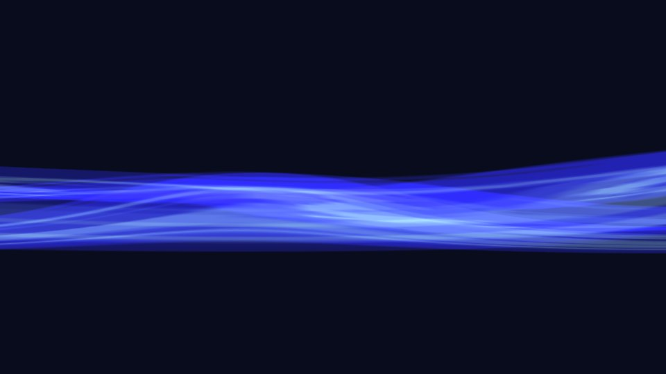 | 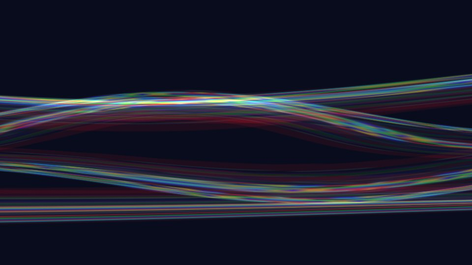 |
| 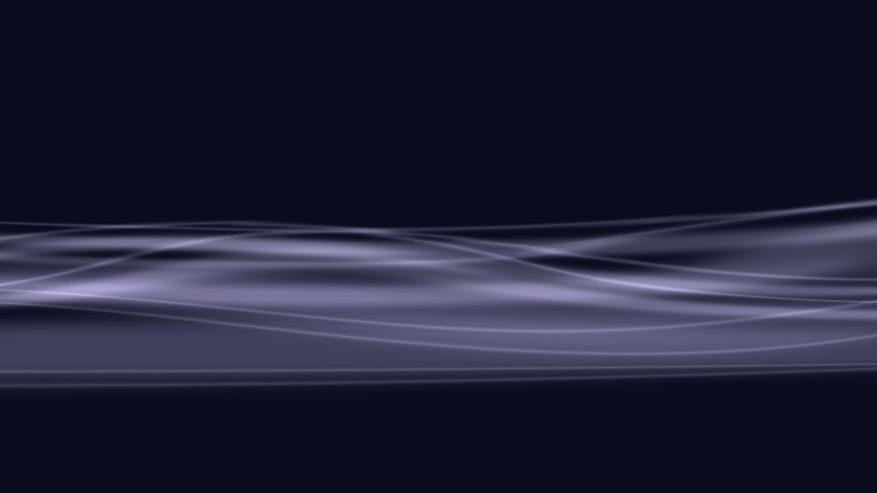 | 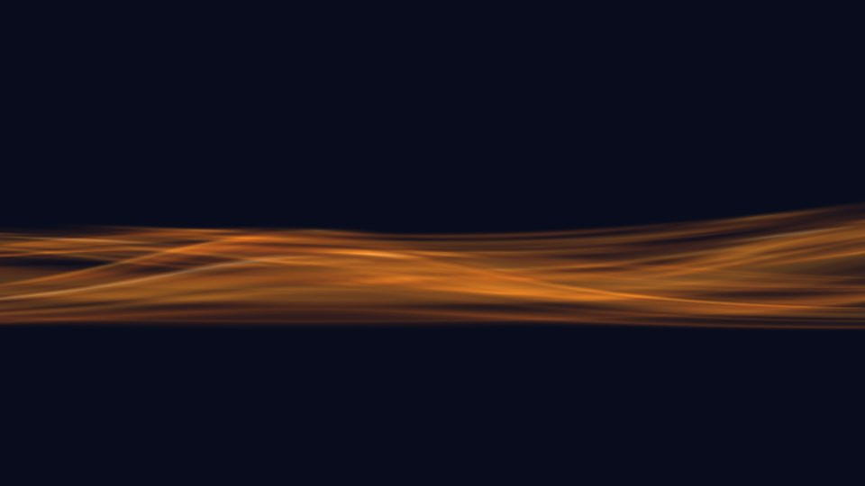 |
| 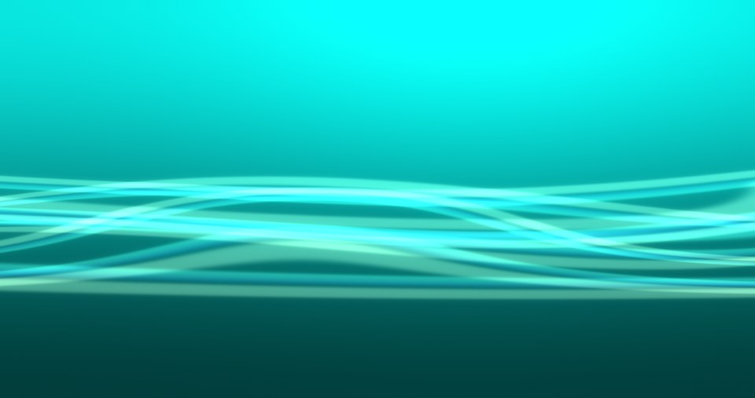 | 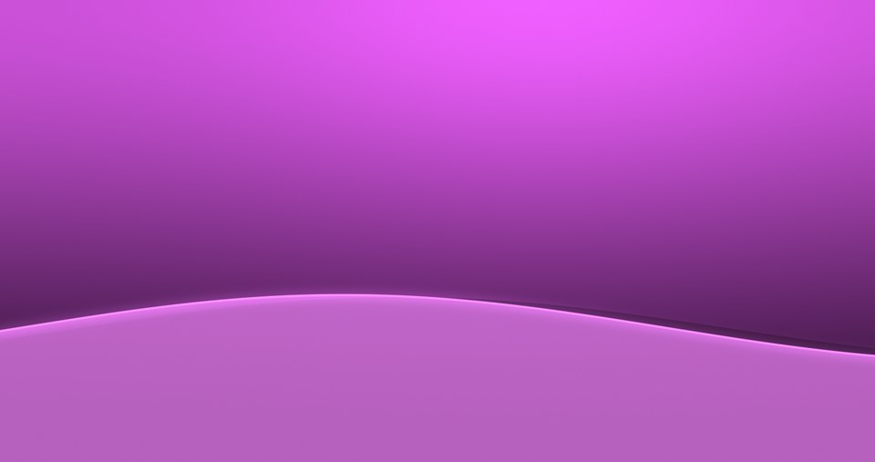 |

Renderer before/after — the wave is now drawn from the real RCO data, not heuristics:

| Before (heuristic) | After (B-spline + fcurves + sphere map) |
|---|---|
| 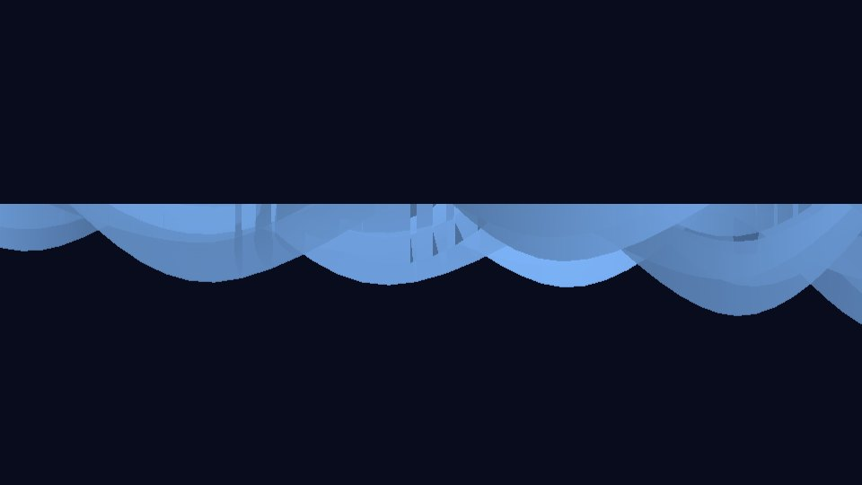 | 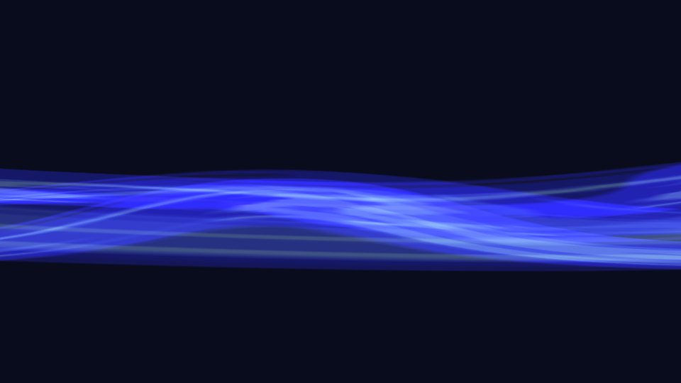 |
| 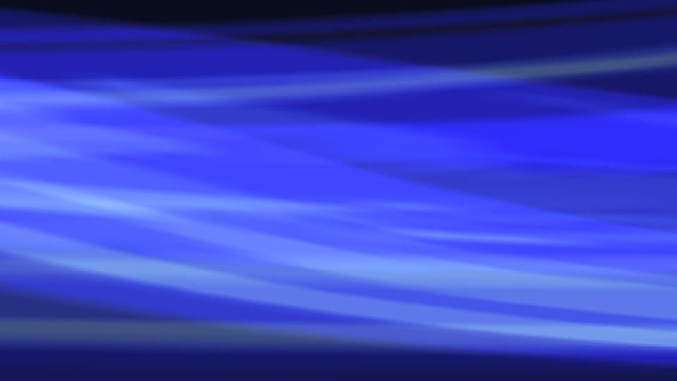 | 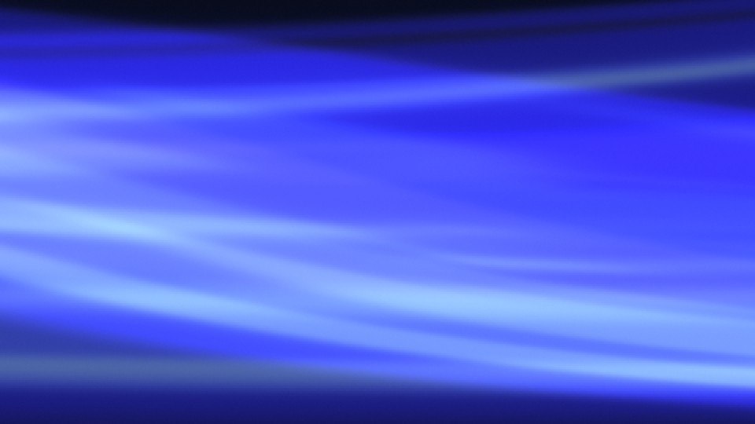 |

Wireframe and the reflection map stored inside the GMO:

| | |
|---|---|
| 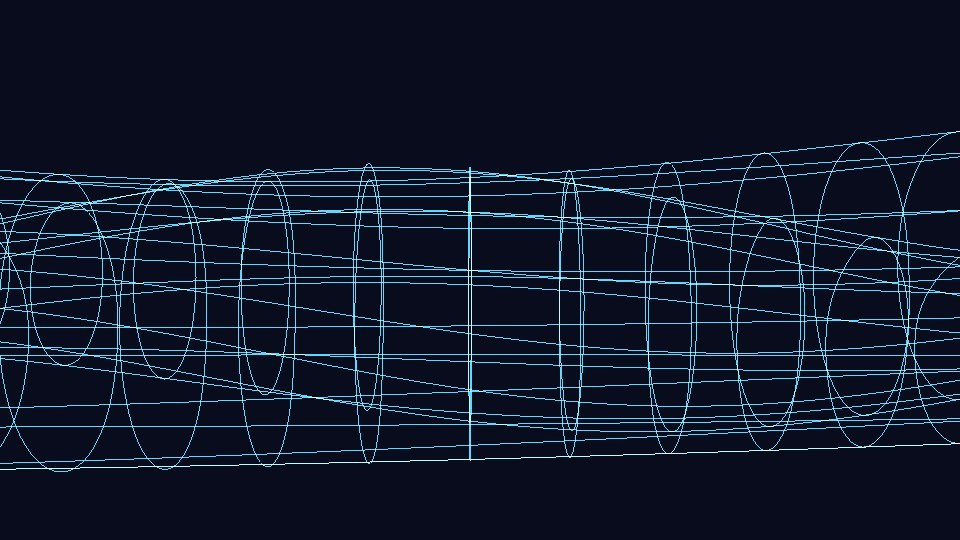 |  |

## Features

- Renders PSP XMB waves from RCO files (GMO B-spline surface + fcurve animation + sphere map)
- Structured `RcoError` handling — never crashes plasmashell on bad RCO
- Async RCO loading on a worker thread
- Binary cache `~/.cache/vlnky/<hash>/xmb_cache_v1.bin` for fast startup
- Adaptive tessellation from FPS, resolution, and battery state
- Configurable background: solid / gradient / image
- Battery detection via sysfs (pause / battery saver)
- HDR post-processing: MSAA, supersampling, bloom, bicubic texture, dither, vignette
- XMB month colours, procedural PS2 (PSX DESR) wave, Svec Studio wave, original wave import
- Custom wave colour and free background colours (solid / gradient / image)
- Python prototype and C++ Qt tests for golden waves

## Architecture

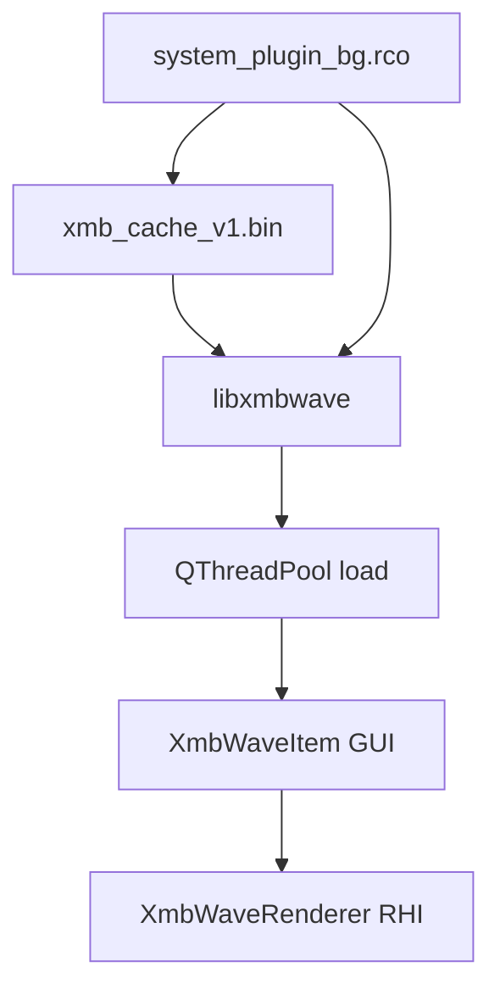

## Dependencies (Fedora)

```bash
sudo dnf install gcc-c++ cmake zlib-devel \
  qt6-qtbase-devel qt6-qtbase-private-devel qt6-qtdeclarative-devel qt6-qtshadertools-devel \
  kf6-kpackage python3
```

Other distributions: see [docs/INSTALL.md](docs/INSTALL.md).

## Build and install

```bash
cd vlnky
cmake -B build -DCMAKE_BUILD_TYPE=Release
cmake --build build
ctest --test-dir build --output-on-failure
bash scripts/install.sh
systemctl --user restart plasma-plasmashell.service
```

Uninstall: `bash scripts/uninstall.sh` (`--purge` also removes the cache).

Golden collection tests (optional):

```bash
export VLNKY_WAVE_COLLECTION="/path/to/176 XMB WAVES"
cmake -B build && cmake --build build
ctest --test-dir build
```

Verify entire collection:

```bash
bash scripts/verify-all-waves.sh "/path/to/176 XMB WAVES" build/vlnky-extract
```

## Logging

```bash
QT_LOGGING_RULES="xmb.*=true" journalctl --user -f -t plasmashell
```

Categories: `xmb.rco`, `xmb.mesh`, `xmb.anim`, `xmb.render`, `xmb.perf`

## Troubleshooting

- **Clear cache:** `rm -rf ~/.cache/vlnky/`
- **Wave missing:** background gradient/color still shows; check `errorCode` on `XmbWaveItem` in debug builds
- **Performance:** lower Quality or enable Battery saver in wallpaper settings

See [docs/INSTALL.md](docs/INSTALL.md) for the full user guide.

## Project layout

```
vlnky/
├── libxmbwave/       # RCO parser, mesh builder, cache v1
├── src/              # QML plugin (XmbWaveItem, WaveScanner)
├── shaders/          # wave.vert / wave.frag → .qsb
├── tests/            # Qt Test
├── prototype/        # Python reference + golden tests
├── plasma-wallpaper/ # Plasma package (QML + KConfig)
├── packaging/        # RPM spec
└── third_party/rhi/  # fallback Qt RHI headers (see NOTICE)
```

## Original Sony wave, XMB colours and PS2 wave

- **Original PSP wave** – extracted from an official Sony system update (not bundled):

  ```bash
  bash scripts/import-original-wave.sh ../EBOOT.PBP        # e.g. the 6.61 updater
  ```

  It adds `PSP Original (OFW x.xx)` to the collection. On the console the wave is white; its
  colour comes from the XMB theme colour.
- **XMB colour** (wallpaper settings): *Original* follows the current month like the PSP/PS3,
  or pick any of the 12 month colours. Optional night dimming (time-of-day brightness).
- **Wave style → PS2 (PSX DESR)**: the two-band sine wave of the PS2-based PSX XMB, rendered
  analytically per pixel (after [OSD-XMB](https://github.com/HiroTex/OSD-XMB), GPL-3).
- **Wave style → Svec Studio wave**: the four layered "hero waves" from the Sencurio landing
  page as used on the svec-studio desktop — filled silhouettes anchored to the bottom edge,
  scrolling sideways and bobbing, tinted by the wave colour over any background.
- **Wave colour**: *Automatic* follows the theme / style default; *Custom colour* tints the
  wave of any style (PSP, PS2, Svec Studio) with a freely chosen colour.

## Render quality (1080p, 1440p, 4K)

Frame graph: wave mesh → RGBA16F scene (MSAA resolve, optional 1.5×/2× supersampling) →
¼-res bloom (box downsample + separable Gaussian) → composite (background, PS2 wave, glow,
vignette, triangular dither) → item texture.

| Setting | Effect |
|---|---|
| Mesh detail *Ultra* | 400×120 B-spline samples – smooth silhouettes on large screens |
| Supersampling 1.5× / 2× | wave rendered above screen resolution and resolved with a tent filter |
| Antialiasing MSAA 2/4/8× | clean edges of the thin wave strands |
| Glow (bloom) | soft PSP-like light around bright strands, radius scales with resolution |
| Smooth (bicubic) texture | B-spline magnification of the 128×128 reflection map |
| Dithering | removes 8-bit banding of dark gradients (backgrounds are drawn by the renderer) |
| Vignette | darkens the corners |

Presets in the settings: *Performance*, *Balanced*, *Beautiful (Full HD+)*, *Maximum (4K)*.
Battery saver forces 1×, no MSAA and no bloom.

Preview with any property: `build/vlnky-preview -r wave.rco --size 1920x1080 --set bloom=0.5 --set waveStyle=1`

## Version

**1.5.0** — Svec Studio wave style (the simple Sencurio landing-page hero waves: four filled
layers at the bottom with per-layer scroll and bob) and a custom wave colour option for all
styles, alongside the existing custom background colours.

**1.4.0** — post-processing pipeline (HDR scene, MSAA, SSAA, bloom, bicubic, dither, vignette),
Ultra mesh detail, XMB month colours with night dimming, procedural PS2 (PSX) wave, import of
the original Sony wave from an official updater.

**1.3.0** — new rendering core (`libxmbwave/psp_wave.cpp`) that follows the real data in the RCO:
the wave is a cubic B-spline surface (22×11 control points, knot vectors from the GMO) with two
interleaved morph targets; the bone matrix (rotation about X) and morph weights are animated by
linear fcurves (1500 frames @ 30 fps). Shading is a sphere-mapped reflection texture (TGA inside
the GMO), modulated by the material diffuse/alpha and blended additively, as on the PSP.
Also fixes an infinite recursion (segfault) in the RCO reader and stale RCO paths in the config.

Optional tuning: `~/.config/vlnky/channel_map.json` (see `docs/channel_map.example.json`) and `invert_textures.txt` (one MD5 hash per line with `invert` or `no-invert`).

## License

GPL-2.0-or-later — see `COPYING`. Third-party material and attributions: `NOTICE`.
PlayStation, PSP, PS2, PSX and XMB are trademarks of Sony Interactive Entertainment; this project
is not affiliated with Sony.
